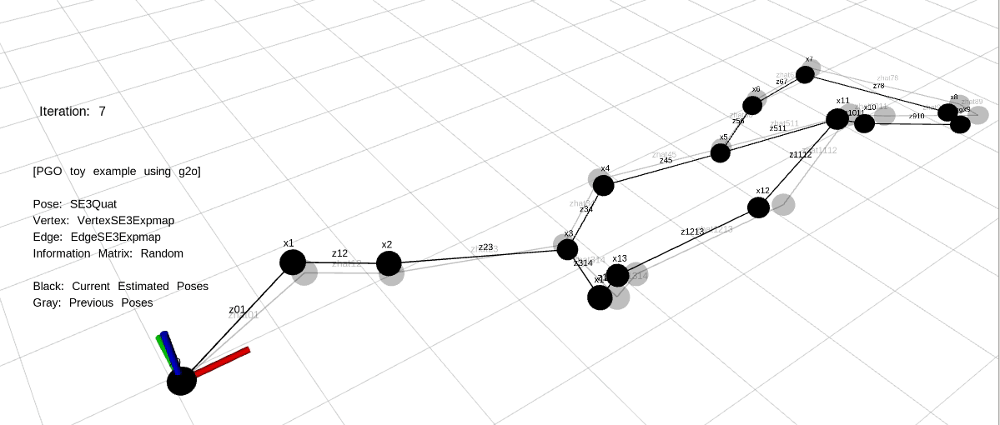

# pgo_toy_example

- A toy example of Pose Graph Optimization (PGO) using g2o library.

## Pose Graph Information
- Pose: SE3Quat
- Vertex: VertexSE3Expmap
- Edge: EdgeSE3Expmap
- Information Matrix: Randomly generated

## Color Information
- Black: Current Estimated Poses
- Gray: Previous Poses

# Requirement
- ROS kinetic (Ubuntu 16.04) or ROS melodic (Ubuntu 18.04) [download](http://wiki.ros.org/ROS/Installation)
- g2o library (2020.07 commit) [download](https://github.com/RainerKuemmerle/g2o) 
  - If you have a g2o version problem, use `31ea135` commit version.
  - In the g2o directory, type `$ git checkout 31ea135` and build the g2o library.

# Instruction
- Clone this repository `git clone https://github.com/edward0im/pgo_toy_example`.
- Put this direcotory into your workspace such as `catkin_ws`.
- Build the workspace using `catkin_make`.
- Update ROS packages using `rospack profile`.
- Run `roslaunch pgo_toy_example pgo_toy_example.launch`.
